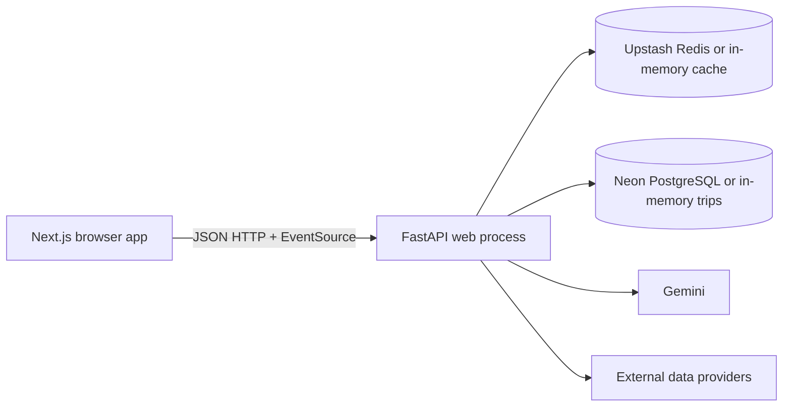

# YatraAI current architecture

Audit date: 2026-08-04
Repository branch: `codex/phase-1-data-trust`

This document records the implementation that exists at the Phase 0 audit. It
describes behavior and ownership as implemented; it is not a proposal for the
next architecture.

## System shape

The repository is a two-part monorepo. The frontend and backend deploy
independently, but itinerary generation is one synchronous request handled by
the FastAPI process. There is no separate worker, job table, queue, migration
system, or provider gateway in the current implementation.

## Frontend routes and responsibilities

| Route | Implementation | Responsibility |
| --- | --- | --- |
| `/` | `frontend/src/app/page.tsx` | Client-side planning form, generation state, live progress subscription, itinerary result, transport selection, refinement, packing list, map, and sharing controls. |
| `/trip/[id]` | `frontend/src/app/trip/[id]/page.tsx` | Fetches and renders a saved itinerary as a read-only shared trip. |
| `/trip/[id]` metadata | `frontend/src/app/trip/[id]/layout.tsx` | Server-side metadata fetch for title, description, and Open Graph data when the backend URL is configured. |

`frontend/src/lib/api.ts` is the single typed HTTP client. It stores the
creator's edit token in browser session storage, adds it to write requests,
wraps fetch timeouts and limited retries, and exposes the progress EventSource
client. The frontend types mirror the backend Pydantic response, but responses
are not runtime-validated before rendering.

Leaflet is dynamically imported in `TripMap.tsx` and is not part of the
initial server render. The rest of the itinerary UI is composed from focused
components such as `TripForm`, `ItineraryTimeline`, `TransportCard`,
`BudgetBreakdown`, `WeatherBadge`, `ShareTrip`, and `TripEnhancements`.

## FastAPI routes

The route modules are mounted by `backend/main.py`:

| Method | Path | Current behavior |
| --- | --- | --- |
| `GET` | `/` | Service identity and docs link. |
| `GET` | `/health` | Configuration-state health response; it does not verify every upstream dependency. |
| `POST` | `/api/trips/generate` | Performs the full itinerary generation inside the request, saves a trip, and returns an `Itinerary`. Accepts `X-Progress-Token`. |
| `GET` | `/api/trips/progress/{token}` | Streams process-local progress messages as Server-Sent Events. |
| `GET` | `/api/trips/{trip_id}` | Loads a saved itinerary. |
| `POST` | `/api/trips/{trip_id}/share` | Returns a frontend share URL for an existing trip. |
| `POST` | `/api/trips/{trip_id}/transport` | Selects one existing option, recalculates the budget, and updates the trip. Requires the creator edit token. |
| `POST` | `/api/trips/{trip_id}/refine` | Sends a follow-up instruction to Gemini, validates the resulting plan, and updates the trip. Requires the creator edit token. |
| `POST` | `/api/trips/{trip_id}/packing-list` | Generates a packing list and updates the trip. Requires the creator edit token. |
| `GET` | `/api/search/cities` | Local Indian-city index first, Nominatim fallback. |
| `GET` | `/api/search/pois` | Overpass POI discovery around coordinates. |
| `GET` | `/api/transport/flights` | Skyscanner search or labelled fallback estimates. |
| `GET` | `/api/transport/trains` | RailRadar schedule search or labelled static/estimated records. |

`TripRequest`, `DataProvenance`, `TransportOption`, `POI`, `DayPlan`,
`BudgetBreakdown`, and `Itinerary` are defined in `backend/app/models/trip.py`.
`DataProvenance` carries provider, status, retrieval/expiry, confidence, source,
and disclaimer metadata; expired facts are treated as unavailable by the
contract. The model layer is Pydantic-only; there is no SQLAlchemy model layer.

## Generation and domain services

`backend/app/services/gemini_planner.py` is the orchestration boundary. Its
current sequence is:

1. Resolve the origin and destination through `geocode_to_city_info`.
2. Compute straight-line distance with `haversine_distance`.
3. Fetch transport, POIs, weather, and destination photos concurrently.
4. Choose one transport option and pass provider data plus POIs to Gemini.
5. Fall back to a deterministic plan when Gemini is unavailable.
6. Canonicalize activities against approved POIs and normalize day numbers,
   dates, meals, and coordinates.
7. Reflow activities around OSRM-derived or estimated route times.
8. Validate timing, opening windows, stop-to-stop feasibility, meal count, and
   summary claims; retry Gemini repairs up to three times.
9. Use a deterministic budget calculation and build the Pydantic itinerary.

The supporting service boundaries are:

- `geocoding.py` and `india_cities.py`: local city index, Nominatim fallback,
  India bounding-box validation, distance calculation, and IATA/station code
  enrichment.
- `transport.py`: Skyscanner RapidAPI flights, RailRadar schedules, static
  train references, fare estimates, and road estimates.
- `poi_discovery.py` and `data/landmark_catalogue.py`: curated reviewed
  landmarks plus Overpass discovery filtered by vibe.
- `weather.py`: OpenWeatherMap five-day/three-hour forecast aggregation and
  weather severity classification.
- `routing.py`: OSRM driving routes, route geometry, and deterministic
  fallback segments used in feasibility and local-transport budgeting.
- `photos.py`: optional Unsplash destination imagery.
- `festivals.py`: static festival data exists, but the generation flow
  currently intentionally leaves festival facts empty.

## Persistence and caching

`trip_storage.py` creates one `trips` table at runtime when `DATABASE_URL` is
configured. It stores the complete itinerary JSON in a JSONB column with a
stable short ID and a SHA-256 hash of the creator edit token. Phase 1 also
includes the external migration `backend/migrations/001_phase1_travel_facts.sql`
for durable fact-level provenance/freshness storage; it is intentionally not
executed by the application at runtime. If setup or a write fails, it stores
the trip in a process-local dictionary.

`redis_cache.py` uses a synchronous Redis client when both Upstash settings are
available. Cache misses, Redis connection failures, and Redis operation
failures fall back to a process-local dictionary with TTL timestamps. The
generation cache stores a serialized itinerary for one hour; provider caches
use service-specific TTLs.

The progress queues and rate-limit windows in `api/trips.py` are also process
local. They are not durable and are not shared between backend instances.

## Deployment and configuration

- Frontend: Vercel, with `frontend` as the root directory and
  `NEXT_PUBLIC_API_URL` pointing to the backend.
- Backend: Render web service, with `backend` as the root directory and
  `uvicorn main:app --host 0.0.0.0 --port $PORT` as the start command.
- Data services: optional Neon PostgreSQL and Upstash Redis.
- External services: Gemini, Skyscanner RapidAPI, RailRadar, OpenWeatherMap,
  Nominatim, Overpass, OSRM, and Unsplash as configured.

Environment loading is implemented by `pydantic-settings` in
`backend/app/config.py` with `.env` and `../.env` lookup. The complete audit
inventory is in [environment-variables.md](environment-variables.md).

## Existing test and verification surface

The backend has the original deterministic tests plus Phase 1 provenance tests
covering request validation,
budgeting, transport labels, POI catalogue coverage, route feasibility,
planner normalization, and shared-trip write protection. The frontend has one
mocked Playwright journey covering generation and a read-only shared link. The
frontend has lint and production-build scripts but no unit-test script or
runtime API schema validation.

The Phase 0 baseline corpus added on this branch is documented in
`backend/tests/fixtures/` and exercised by
`backend/tests/test_baseline_fixtures.py`.
