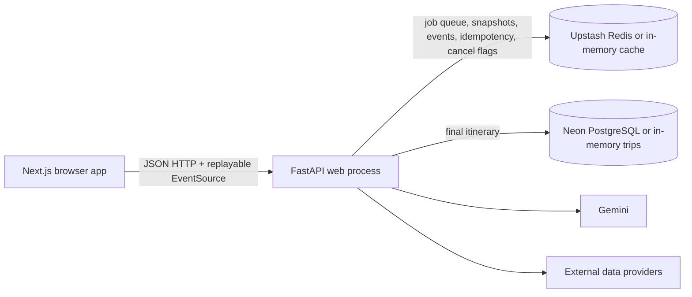

# YatraAI current architecture

Audit date: 2026-08-04
Repository branch: `codex/phase-7-production-hardening`

This document records the implementation that exists at the Phase 5 boundary.
It describes behavior and ownership as implemented; it is not a proposal for
the next architecture.

## System shape

The repository is a two-part monorepo. The frontend and backend deploy
independently. The primary generation path now submits a short asynchronous
job request; a FastAPI-hosted worker consumes the queued job and writes
replayable progress events. Redis provides the shared transport when configured
and the existing process-local cache remains the development fallback. Final
itineraries are saved through the PostgreSQL-compatible trip store.

## Frontend routes and responsibilities

| Route | Implementation | Responsibility |
| --- | --- | --- |
| `/` | `frontend/src/app/page.tsx` | Client-side planning flow, quick natural-language brief, detailed review form, durable generation state, single-destination workspace, multi-city route studio, transport selection, refinement, packing list, map, and sharing controls. |
| `/trip/[id]` | `frontend/src/app/trip/[id]/page.tsx` | Fetches and renders a saved itinerary as a read-only shared trip. |
| `/trip/[id]` metadata | `frontend/src/app/trip/[id]/layout.tsx` | Server-side metadata fetch for title, description, and Open Graph data when the backend URL is configured. |

`frontend/src/lib/api.ts` is the single typed HTTP client. It stores the
creator's edit token in browser session storage, adds it to the appropriate
requests, wraps fetch timeouts and limited retries, and exposes both the legacy
and replayable job EventSource clients. The home page persists the active job ID,
idempotency key, request, and last event ID in local storage so refreshes and
navigation can reconnect to the same generation. The frontend types mirror the
backend Pydantic response, but responses are not runtime-validated before
rendering.

Leaflet is dynamically imported in `TripMap.tsx` and is not part of the
initial server render. The rest of the itinerary UI is composed from focused
components such as `QuickPlanner`, `TripForm`, `TripWorkspace`,
`TripConversation`, `ItineraryTimeline`, `TransportCard`, `BudgetBreakdown`,
`WeatherBadge`, `ShareTrip`, and `TripEnhancements`.

## FastAPI routes

The route modules are mounted by `backend/main.py`:

| Method | Path | Current behavior |
| --- | --- | --- |
| `GET` | `/` | Service identity and docs link. |
| `GET` | `/health` | Configuration-state health response, including selected provider flags; it does not verify every upstream dependency. |
| `POST` | `/api/trips/generate` | Legacy compatibility route that performs full generation inside the request, saves a trip, and returns an `Itinerary`. Accepts `X-Progress-Token`; the frontend uses `/api/trip-jobs`. |
| `GET` | `/api/trips/progress/{token}` | Streams process-local progress messages as Server-Sent Events. |
| `POST` | `/api/trip-jobs` | Accepts a generation request, applies the generation rate limit, reserves `Idempotency-Key`, and returns a job snapshot with HTTP 202. |
| `GET` | `/api/trip-jobs/{job_id}` | Returns the current job state, progress, retry count, and saved-result ID. |
| `GET` | `/api/trip-jobs/{job_id}/events` | Replays events after `Last-Event-ID` or `last_event_id`, then streams until the job is terminal. |
| `POST` | `/api/trip-jobs/{job_id}/cancel` | Sets a durable cancellation flag and publishes a cancellation progress event. |
| `GET` | `/api/trip-jobs/{job_id}/result` | Returns the saved itinerary after completion and exposes its creator edit token. |
| `GET` | `/api/trips/{trip_id}` | Loads a saved itinerary. |
| `POST` | `/api/trips/{trip_id}/share` | Returns a frontend share URL for an existing trip. |
| `POST` | `/api/trips/{trip_id}/transport` | Selects one existing option, recalculates the budget, and updates the trip. Requires the creator edit token. |
| `POST` | `/api/trips/{trip_id}/refine` | Parses common edits into scoped deterministic changes where possible; otherwise constrains Gemini to affected days, then validates and updates the trip. Requires the creator edit token. |
| `POST` | `/api/trips/{trip_id}/undo` | Restores the previous server-saved itinerary revision and swaps the current version into the revision slot. Requires the creator edit token. |
| `POST` | `/api/trips/{trip_id}/packing-list` | Generates a packing list and updates the trip. Requires the creator edit token. |
| `POST` | `/api/multi-city/generate` | Generates a canonical multi-city `Trip` with explicit stays, legs, visits, day shells, selections, and budget. |
| `GET` | `/api/multi-city/{trip_id}` | Loads a saved multi-city trip. |
| `POST` | `/api/multi-city/{trip_id}/reorder` | Reorders every destination stay and recalculates the affected travel-leg graph. Requires the creator edit token. |
| `PATCH` | `/api/multi-city/{trip_id}/stays/{stay_id}` | Changes one stay's nights/notes and shifts only dependent dates and leg dates; destination visits retain stable identities. Requires the creator edit token. |
| `GET` | `/api/search/cities` | Local Indian-city index first, Nominatim fallback. |
| `GET` | `/api/search/pois` | Overpass POI discovery around coordinates. |
| `GET` | `/api/transport/flights` | Skyscanner search or labelled fallback estimates. |
| `GET` | `/api/transport/trains` | RailRadar schedule search or labelled static/estimated records. |

`TripRequest`, `MultiCityTripRequest`, `TripIntent`, `DataProvenance`,
`TransportOption`, `POI`, `DayPlan`, `BudgetBreakdown`, `Itinerary`, and the
canonical multi-city entities are defined in
`backend/app/models/trip.py`.
`DataProvenance` carries provider, status, retrieval/expiry, confidence, source,
and disclaimer metadata; expired facts are treated as unavailable by the
contract. The model layer is Pydantic-only; there is no SQLAlchemy model layer.

## Generation and domain services

`backend/app/services/gemini_planner.py` remains the domain orchestration
boundary. `backend/app/services/trip_jobs.py` wraps it in a worker lifecycle:

1. Reserve an idempotency key and persist the accepted job snapshot.
2. Queue the job and claim it with a short-lived worker lease.
3. Forward planner callbacks into named job states and monotonic replayable
   events.
4. Retry transient failures once, classify validation/request errors separately,
   and stop at a user-safe terminal state.
5. Save the completed itinerary and mark the job terminal.

The planner's current sequence is:

1. Resolve the origin and destination through `geocode_to_city_info`.
2. Compute straight-line distance with `haversine_distance`.
3. Fetch transport, POIs, weather, and destination photos concurrently.
4. Translate the request into a structured `TripIntent`.
5. Run `constraint_engine.py` over reviewed candidates to produce a
   machine-readable schedule, including pace limits, meal breaks, opening
   windows, travel buffers, weather/accessibility suitability, transport
   windows, mandatory/excluded places, and deterministic budget checks.
6. Pass that candidate schedule to Gemini for descriptions, notes, meals, tips,
   and explanations; Gemini is not trusted as the source of exact timings.
7. Fall back to the deterministic schedule when Gemini is unavailable.
8. Canonicalize activities against approved POIs and normalize day numbers,
   dates, meals, and coordinates.
9. Reflow activities around OSRM-derived or estimated route times.
10. Validate timing, opening windows, stop-to-stop feasibility, pace, meal count, and
   summary claims; retry Gemini repairs up to three times.
11. Use a deterministic budget calculation and build the Pydantic itinerary.

The Phase 6 multi-city sequence is deliberately separate from the Gemini path:
resolve the origin and every stay, create dated stays, fetch each destination's
POIs/weather, build one leg for origin → first stay → … → origin, choose a
provider-labelled offer, and compose stable visits/day shells. Reordering calls
the leg builder for the new sequence but shifts existing visit identities;
editing nights shifts dates and leg dates without rediscovering unrelated
destination places.

The supporting service boundaries are:

- `geocoding.py` and `india_cities.py`: local city index, Nominatim fallback,
  India bounding-box validation, distance calculation, and IATA/station code
  enrichment.
- `transport.py`: Skyscanner RapidAPI flights, RailRadar schedules, static
  train references, fare estimates, and road estimates.
- `poi_discovery.py` and `data/landmark_catalogue.py`: curated reviewed
  landmarks plus Overpass discovery filtered by vibe.
- `weather.py`: OpenWeatherMap five-day/three-hour forecast aggregation,
  normalized timestamps, derived rain/heat advisories, and weather severity
  classification consumed by the deterministic constraint engine.
- `routing.py`: OSRM driving routes, route geometry, and deterministic
  fallback segments used in feasibility and local-transport budgeting.
- `providers/contracts.py`: provider-neutral request/result models and adapter
  protocols for flights, rail, places, routes, and weather.
- `providers/gateway.py` and `providers/resilience.py`: feature-flagged adapter
  selection, bounded timeout/retry execution, and circuit breakers.
- `photos.py`: optional Unsplash destination imagery.
- `festivals.py`: static festival data exists, but the generation flow
  currently intentionally leaves festival facts empty.
- `multi_city_planner.py`: deterministic multi-city composition and scoped route
  edits over provider-backed geocoding, transport, POI, and weather facts.

`constraint_engine.py` also owns `parse_refinement_instruction` and
`apply_scoped_refinement`. Edits such as “make day two less crowded”, “reduce
the budget”, “avoid early morning travel”, transport switches, activity moves,
deletions, custom additions, duration changes, locks, and day regeneration are
represented as structured commands. Deterministic edits are reflowed and
validated before persistence; other edits are sent to Gemini with an
affected-day merge that preserves unrelated days before server-side validation.

## Persistence and caching

`trip_storage.py` creates the legacy `trips` table and the Phase 6
`multi_city_trips` aggregate table at runtime when `DATABASE_URL` is configured.
The multi-city table stores the aggregate JSON plus queryable stay, leg, visit,
day, and transport-selection projections. Both trip types retain
stable short IDs and a SHA-256 hash of the creator edit token. Phase 1 also
includes the external migration `backend/migrations/001_phase1_travel_facts.sql`
for durable fact-level provenance/freshness storage, Phase 2 includes
`backend/migrations/002_phase2_trip_jobs.sql` for the operational job snapshot
schema, and Phase 4 includes `backend/migrations/003_phase4_trip_revisions.sql`
for one-step workspace undo. Phase 6 includes
`backend/migrations/004_phase6_multi_city.sql` for the multi-city
aggregate/projections. Phase 7 adds
`backend/migrations/005_phase7_collaboration_analytics.sql` for collaboration,
analytics, and audit tables. Migration
`backend/migrations/006_remove_legacy_account_schema.sql` removes the retired
account schema from databases that used the earlier account-based build.
`backend/migrations/007_remove_legacy_accommodation_projection.sql` removes a
retired multi-city projection from databases that used the earlier itinerary
shape. Those
migrations are intentionally not executed by the
application at runtime. The active Phase 2 queue/snapshot/event transport is Redis-first; if
setup or a write fails, trip storage falls back to a process-local dictionary.

`redis_cache.py` uses a synchronous Redis client when both Upstash settings are
available. Cache misses, Redis connection failures, and Redis operation
failures fall back to a process-local dictionary with TTL timestamps. The
generation cache stores a serialized itinerary for one hour; provider caches
use service-specific TTLs.

Trip-job queue, snapshots, event history, idempotency reservations,
cancellation flags, and the generation rate limit use the shared Redis client
when configured. Without Redis they fall back to process-local state and are
not durable or shared between backend instances. The old synchronous generation
and process-local progress endpoints remain for backwards-compatible clients;
the frontend uses the new job endpoints.

## Deployment and configuration

- Frontend: Vercel, with `frontend` as the root directory and
  `NEXT_PUBLIC_API_URL` pointing to the backend.
- Backend: Render web service, with `backend` as the root directory and
  `uvicorn main:app --host 0.0.0.0 --port $PORT` as the start command.
- Data services: optional Neon PostgreSQL and Upstash Redis; PostgreSQL is
  required in production when durable itinerary/share storage is enabled.
- Access model: no accounts or login. The creator receives an anonymous edit
  token in the response header, and optional share links grant read or edit
  access to a persisted itinerary.
- External services: Gemini, Skyscanner RapidAPI, RailRadar, OpenWeatherMap,
  Nominatim, Overpass, OSRM, and Unsplash as configured.
- Provider selection and resilience use built-in defaults; unsupported or
  unavailable upstream data degrades to the existing labelled fallback state.

Environment loading is implemented by `pydantic-settings` in
`backend/app/config.py` with `.env` and `../.env` lookup. The complete audit
inventory is in [environment-variables.md](environment-variables.md).

## Existing test and verification surface

The backend has the original deterministic tests plus Phase 1 provenance tests
covering request validation,
budgeting, transport labels, POI catalogue coverage, route feasibility,
planner normalization, and shared-trip write protection. The frontend has one
mocked Playwright journey covering generation and a read-only shared link. The
frontend has lint and production-build scripts but no unit-test script or
runtime API schema validation.

Phase 2 adds direct service tests for idempotency, event replay, cancellation,
retry, stable edit tokens, and an HTTP-level job lifecycle test covering submit,
poll, SSE replay, result retrieval, and duplicate submission behavior.

Phase 3 adds deterministic engine tests for intent mapping, rainy-day candidate
selection, opening hours, travel buffers, pace, accessibility, mandatory and
excluded places, budget trimming, and structured refinement. A planner
regression test verifies that a scoped day-two edit preserves day-one activity
order, timing, meals, and notes.

The Phase 0 baseline corpus added on the Phase 0 branch is documented in
`backend/tests/fixtures/` and exercised by
`backend/tests/test_baseline_fixtures.py`.

Phase 4 adds focused command parsing/scoping coverage for workspace activity
edits and extends the mocked Playwright journey to exercise the workspace,
mobile tabs, and conversation surface. Backend test execution still requires
the repository's Python test dependencies to be installed in the environment.

Phase 5 adds adapter normalization and provider-gateway contract tests for
timeouts, bounded retries, circuit opening, and schedule-only rail behavior.
The live legacy providers remain
behind the gateway and preserve their existing provenance/fallback contracts.

Phase 6 adds tests for three-city generation, return-leg composition, reorder
leg recalculation, and stay-scoped edits that preserve unrelated visit
identities. The current test surface also verifies anonymous edit-token access,
collaboration permissions, durable-storage fail-closed behavior, and that the
removed account routes are no longer registered.
