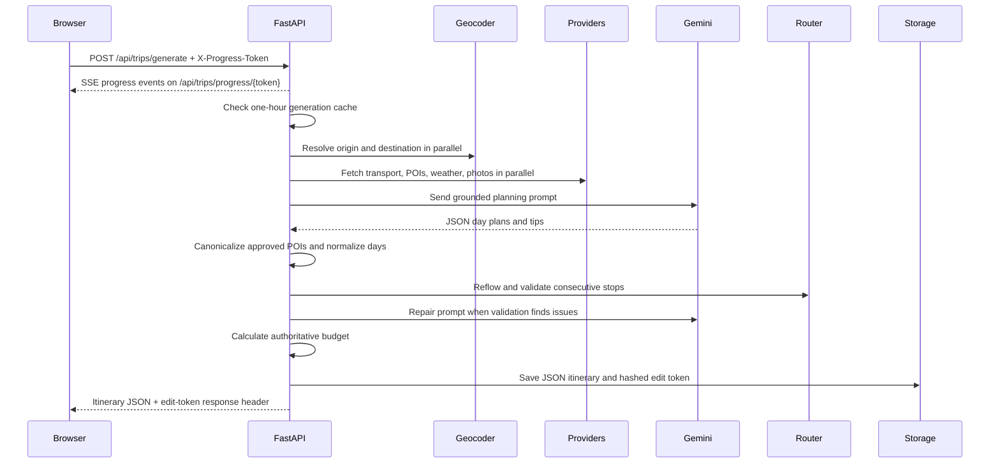

# YatraAI itinerary-generation flow

## Current request path

## Stages

### 1. Input validation

FastAPI validates `TripRequest` with Pydantic. The model rejects same-city
trips, past departures, reversed dates, trips longer than 14 days, budgets
below ₹1,500 per traveller, and senior counts above adult counts.

### 2. Location resolution

`geocode_to_city_info` uses the local Indian city index first. Unknown cities
go through rate-limited Nominatim with a country code and an India bounding-box
check. The result is a `CityInfo` with coordinates and optional transport
codes.

### 3. Context collection

`generate_itinerary` concurrently asks for transport, destination POIs,
weather, and photos. Provider errors are converted into empty results or
fallback options and recorded in `generation_notes`. Transport selection is
made deterministically before the planning prompt and is the same option used
by the budget calculator.

### 4. Grounded AI proposal

`_build_planning_prompt` includes request preferences, the selected transport,
the complete approved POI input, and available weather data. Gemini is asked
for JSON day plans, activities, meals, backup activities, and tips. It is not
trusted for totals, coordinates, or unapproved place names.

When Gemini is missing or returns invalid JSON, `_build_fallback_plan` creates
a basic plan from the approved POI list.

### 5. Canonicalization and validation

`_canonicalize_plan` fixes day numbers/dates, drops activities that do not
resolve to approved POIs, maps close coordinate aliases, supplies missing
meals, and fills empty interior days. `_repair_plan_schedule` uses route
feasibility results to reflow activity times and opening windows.

`_validate_plan` checks:

- expected number of days;
- at least two meals per day;
- interior-day activity presence;
- summary claims against activity names/categories;
- valid and non-overlapping times;
- stated visit duration;
- known opening windows;
- every consecutive route segment;
- travel-time gaps;
- a maximum 12-hour day window.

Up to three Gemini repair attempts are made. If issues remain, the planner
tries a deterministic fallback and fails the request if that fallback is also
infeasible.

### 6. Authoritative response construction

`_plan_to_itinerary` converts approved activities into Pydantic `Activity` and
`POI` objects, attaches the same route segments used in validation, and
calculates a `BudgetBreakdown` from selected transport, meal costs, activity
costs, local route estimates, transfers, accommodation, and a five-percent
buffer. The model does not accept category totals from Gemini.

### 7. Save and client handoff

The API saves an itinerary with a random edit token whose SHA-256 hash is
stored. It returns the edit token only in `X-Trip-Edit-Token`, and the browser
keeps it in session storage. A cache hit creates a new persisted trip record
and a new edit capability rather than exposing the cached trip's sharing
identity.

## Progress semantics

The browser creates a random progress token and opens an EventSource before
posting the generation request. The current server emits `starting`,
`geocoding`, `trip_context`, `planning`, `validating`, `routing`, `ready`, and
`complete` milestones, plus `cached` or `failed` outcomes. Events are queued
in a process-local `asyncio.Queue`; there are no event IDs, replay, or
`Last-Event-ID` handling.

The API request itself remains open for the full generation. The frontend
timeout defaults to 90 seconds and retries one time for eligible failures.
Because the server has no idempotency key or durable job record, a client retry
can represent a second generation request.

## Current failure behavior

- Missing optional provider keys produce labelled fallbacks or empty data.
- Provider exceptions are logged and usually converted into fallback/empty
  results.
- Missing Gemini produces a deterministic POI-based plan.
- Validation errors after repair may produce a deterministic fallback or a
  user-visible HTTP 400/500 error.
- A database setup/write/read failure logs an error and falls back to memory.
- A Redis failure silently uses the in-process cache.

These behaviors are useful local-development safeguards but are not durable
production guarantees. Phase 2 should move the long-running path to a job
workflow, and Phase 1 should normalize the status/freshness signals before
they are rendered as travel facts.
