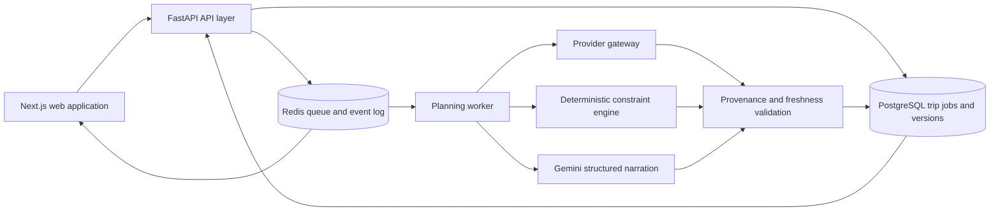

# YatraAI target architecture

This is the target logical architecture from the master implementation plan.
It is documentation only in Phase 0. No target worker, database migration,
provenance model, or provider gateway is introduced by this audit.

## Logical shape



## Responsibilities

### Next.js web application

The browser should submit a structured request with an idempotency key, track
a durable job through a reconnectable event stream, and render a validated
response. It should retain the simple planner-to-workspace journey and keep
map loading deferred. TanStack Query, Zod, React Hook Form, dnd-kit, and a
small Zustand workspace store are planned additions, not Phase 0 changes.

### FastAPI API layer

The API should validate input, accept and deduplicate jobs, expose job status
and result resources, enforce authorization and rate limits, and return
provider-neutral domain objects. It should not run the long-lived planner
inside the web request.

Planned job endpoints are:

```text
POST /api/trip-jobs
GET  /api/trip-jobs/{job_id}
GET  /api/trip-jobs/{job_id}/events
POST /api/trip-jobs/{job_id}/cancel
GET  /api/trip-jobs/{job_id}/result
```

### Planning worker

The worker should make the stages explicit and resumable:

```text
accepted
retrieving_data
resolving_locations
fetching_transport
fetching_places
fetching_weather
optimising
generating_narrative
validating
saving
completed | failed | cancelled
```

Each stage should be idempotent, publish a durable event, and record a
user-safe failure reason. Retries should be bounded and tied to the provider or
stage that failed.

### Provider gateway

Flight, hotel, rail, bus, route, weather, and place adapters should expose
provider-neutral interfaces. Provider identifiers and raw responses remain
inside the adapter boundary. Every result should carry the common
`DataProvenance` contract:

```text
provider
status: live | recently_verified | schedule_only | estimated |
        static_reference | unavailable
retrieved_at
expires_at
confidence
source_reference
disclaimer
```

Provider choice should be controlled by environment-backed feature flags, and
each adapter should have a timeout, controlled retries, and a circuit breaker.

### Constraint engine

The engine should turn a structured `TripIntent` plus provider-neutral
candidates into a machine-readable itinerary before any narrative is written.
It must enforce visit duration, opening windows, route time, check-in/out,
arrival/departure limits, meal breaks, pace, accessibility, weather, and
budget constraints. Google OR-Tools or an equally deterministic scheduling
component is a later implementation choice.

### AI narration

Gemini may extract intent, explain choices, narrate verified places, create
tips, and propose alternatives. It must not be authoritative for fares,
transport numbers, coordinates, opening hours, availability, or exact timing.
All model output must be schema-validated and checked against approved facts
and the constraint engine before persistence.

## Durable data model direction

The planned stable-UUID entities are:

```text
users, user_preferences, consent_records
trips, trip_travellers, destination_stays, travel_legs
itinerary_days, itinerary_visits, itinerary_versions
places, place_provider_links, accommodations
transport_offers, weather_snapshots, route_segments, travel_facts
trip_jobs, trip_job_events, trip_edits, share_links, collaborators
```

Itinerary versions should be immutable. Edits should create a new version or a
structured edit record. External provider IDs belong in provider-link fields,
offers need expiry timestamps, and shared edit tokens must be hashed.

## Migration principles

1. Keep the current FastAPI monolith modular while moving long-running work to
   a worker.
2. Introduce migrations before changing production tables; do not depend on
   runtime `CREATE TABLE`/`ALTER TABLE` calls.
3. Add domain/provenance models before changing frontend claims.
4. Preserve the current providers until replacements are tested.
5. Make every paid integration optional with a configured fallback and clear
   status.
6. Preserve anonymous trips and the simple single-destination journey while
   durable generation is stabilized.

## Explicit non-goals for this phase

Phase 0 does not implement job endpoints, workers, Redis event replay,
PostgreSQL migrations, OR-Tools, provider replacements, authentication,
multi-city trips, offline access, or the Phase 4 visual redesign.
